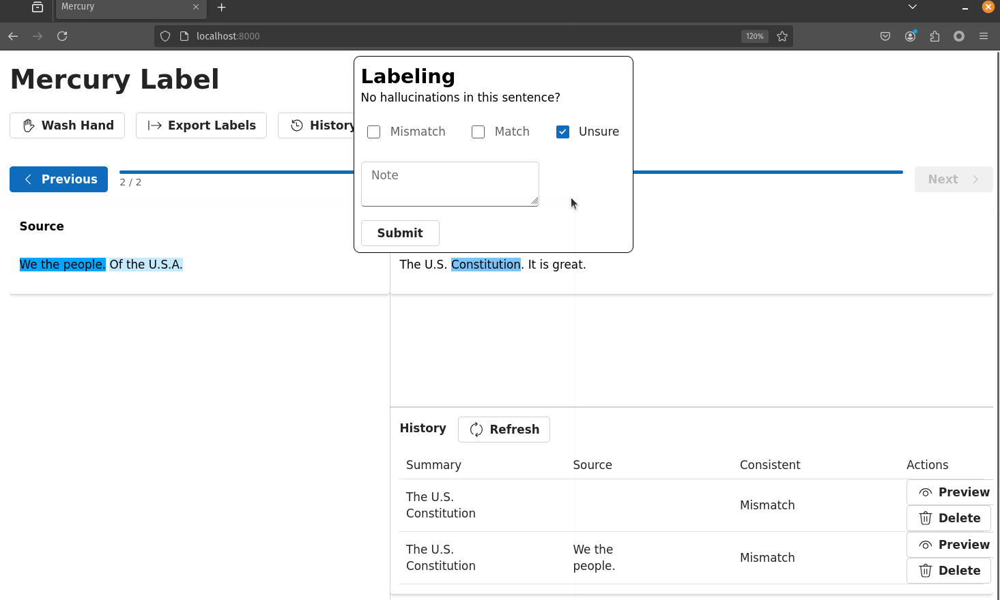
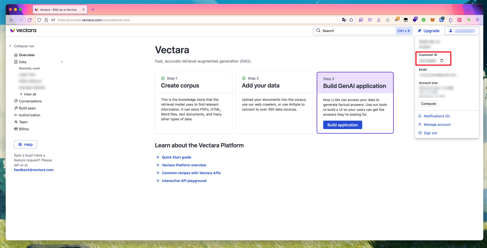

# Mercury

> [!NOTE]
> WIP: This project is under active development

Mercury is a semantic-assisted, cross-text text labeling tool.

1. semantic-assisted: when you select a text span, semantically related text segments will be highlighted -- so you don't have to eyebal through lengthy texts.
2. cross-text: you are labeling text spans from two different texts.

Therefore, Mercury is very efficient for the labeling of NLP tasks that involve comparing texts between two documents which are also lengthy, such as hallucination detection or factual consistency/faithfulness in RAG systems. Semantic assistance not only saves time and reduces fatigues but also avoids mistakes.

Currently, Mercury only supports labeling inconsistencies between the source and summary for summarization in RAG.

Mercury is powered by Vectara's semantic search engine -- which is among the best in the industry, and all your data, including human-generated annotations are securely stored in Vectara's bullet-proof data infrastructure.



## Usage

> [!NOTE]
> You need Python and Node.js.

0. Install dependencies

   `pip3 install -r requirements.txt`

1. Set up your Vectara credentials

    As mentioned before, we use Vectara, you need to set the following environment variables first:

    - `VECTARA_CUSTOMER_ID`: Find your customer ID in the Vectara console as below:

        

    - `VECTARA_API_KEY`: Find or create your personal API key [here](https://console.vectara.com/console/apiAccess/personalApiKey).

    You can also save the above environment variables to a `.env` file.

2. Ingest data for labeling to Vectara

   Run `python3 ingester.py -h` to see the options.

   The ingester takes a CSV, JSON, or JSONL file of two fields/columns for each sample: `source` and `summary`. Both fields are strings. Mercury uses three Vectara corpora to store the sources, the summaries, and the human annotations. You can provide the corpus IDs to overwrite or append data to existing corpora.

3. `pnpm install && pnpm build` (if you don't have `pnpm` installed: `npm install -g pnpm`, you may need sudo)
4. `python3 server.py`
5. To dump existing annotations, run `python3 database.py -h` to see how.

## Technical details

For each dataset for labeling, Mercury uses three Vectara corpora:

1. Source
2. Summary
3. Annotation -- no text data. metadata is used to store the human annotations.

In summarization, a summary corresponds to a source. The source corpus is the opposite of the summary corpus. And vice versa.
The three parts of a sample can be associated across the three corpora by a metedata field called `id`.

A source or a summary is a document in its corresponding corpus. Each sentence is a chunk in the document. Thus, each sentence is embedded into a vector.

For each sample, Mercury displays the source and the summary side by side. The user can select a text span from the source and the summary and label the inconsistency between them.

When a text span is selected, Mercury uses Vectara's search engine to find semantically related text spans in the opposite corpus, e.g., selecting text in summary and searching in source. The related text spans are highlighted.

The dumped human annotations are stored in a JSON format like this:

```python
[
    {# first sample 
        'source': str, 
        'summary': str,
        'annotations': [ # a list of annotations from many human annotators
            {
                'source': {
                    'text': str,
                    'start': int,
                    'end': int,
                },
                'summary': {
                    'text': str,
                    'start': int,
                    'end': int
                },
                'label': str,
                'annotator': str
            }
        ]
    }
]
```
