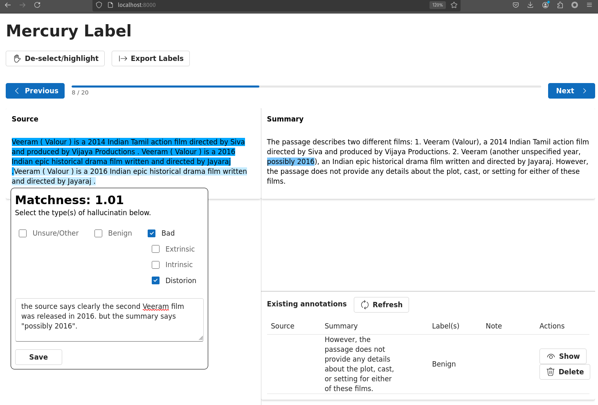

# Mercury

Mercury is a semantic-assisted, cross-text text labeling tool.

1. search-assisted: when you select a text span, semantically or lexically related text segments will be highlighted -- so you don't have to eyeball through lengthy texts.
2. cross-text: you are labeling text spans from two different texts.

Therefore, Mercury is very efficient for the labeling of NLP tasks that involve comparing texts between two documents which are also lengthy, such as hallucination detection or factual consistency/faithfulness in RAG systems. Search assistance not only saves time and reduces fatigues but also avoids mistakes.



## Dependencies and setup

1. `pip3 install -r requirements.txt && python3 -m spacy download en_core_web_sm`

2. If you don't have `pnpm` installed, please install with `npm install -g pnpm` - you may need `sudo`. If you don't have `npm`, try `sudo apt install npm`.

3. Compile the frontend: `pnpm install && pnpm build`

4. <details><summary>Upgrade SQLite to 3.41+ (if necessary)</summary>

   You must upgrade SQLite to 3.41+ to use `sqlite-vec` via Python's built-in `sqlite3` module. Otherwise, `LIMIT` or `k=?` will not work properly with `rowid IN (?)` for vector search. On Ubuntu 22.04, the SQLite version is [3.37](https://launchpad.net/ubuntu/jammy/+source/sqlite3). Note that Python's built-in `sqlite3` module uses its own binary library that is independent of the OS's SQLite. So upgrading the OS's SQLite will not upgrade Python's `sqlite3` module.

   To manually upgrade Python's `sqlite3` module to version 3.41+, here are the steps: 

      * Download and compile SQLite>3.41.0 from source
        ```bash
        wget https://www.sqlite.org/2024/sqlite-autoconf-3460100.tar.gz 
        tar -xvf sqlite-autoconf-3460100.tar.gz
        cd sqlite-autoconf-3460100
        ./configure
        make
        ```

      * Set Python's built-in `sqlite3` module to use the compiled SQLite.
        Suppose you are currently at path `$SQLITE_Compile`. Then set this environment variable (feel free to replace
        `$SQLITE_Compile` with the actual absolute/relative path):

        ```bash
        export LD_PRELOAD=$SQLITE_Compile/.libs/libsqlite3.so
        ```
        You may add the above line to `~.bashrc` to make it permanent.

      * Verify that Python's `sqlite3` module is using the correct SQLite, run this Python code:
        ```shell
        python3 -c "import sqlite3; print(sqlite3.sqlite_version)"
        ```
        If the output is the version of SQLite you just compiled, you are good to go.

      * If you are using Mac and run into troubles, please follow
        SQLite-vec's [instructions](https://alexgarcia.xyz/sqlite-vec/python.html#updated-sqlite).


   To use `sqlite-vec` directly in `sqlite` prompt, simply [compile
   `sqlite-vec` from source](https://alexgarcia.xyz/sqlite-vec/compiling.html) and load the compiled `vec0.o`. The usage
   can be found in the SQLite-vec's [README](https://github.com/asg017/sqlite-vec?tab=readme-ov-file#sample-usage).
   </details>

## Usage

Mercury is powered by two SQLite databases:

1. `CORPUS_DB`: the corpus and annotations (if annotated)
2. `USER_DB`: the ID and authentication info of annotators

You can pair the same `USER_DB` with multiple `CORPUS_DB`s for the same group of users to annotate different corpora.

### Steps

1. Prepare the cross-text data for labeling. The data should be in JSON or JSONL format. The first two columns/fields are mandatory and must be in text-type. They will be cross-text annotated. The rest of the columns/fields are optional and will be stored as metadata. Like below:

   ```json
   {
       "source": "The quick brown fox. Jumps over a lazy dog. ",
       "summary": "26 letters.", 
       "timestamp": "2025-06-24 11:23:16",
       "from_dataset": "XYZ"
   }
   ```

   A more real example is given in the file `example_data/to_ingest.json`.

2. Ingest data for labeling

   Run `python3 ingester.py -h` to see the options. The default embedder is `dummy` (random numbers). If you use OpenAI-based embedders, please set the environment variable `OPENAI_API_KEY` to your OpenAI API key. Other open source embedders will be pulled from Huggingface and please be sure you have enough hardware resources (e.g., GPU) to run them. **If you change the embedding model, you must overwrite the existing data in `CORPUS_DB`**.

   After ingestion, the data will be stored in the `CORPUS_DB` SQLite database.

3. Manually set the labels for annotators to choose from in the `labels.yaml` file. Mercury supports hierarchical labels.

4. Generate and set a JWT secret key: 
   
   ```export SECRET_KEY=$(openssl rand -base64 32)```
   
   You can rerun the command above to generate a new secret key when needed, especially when the old one is compromised. Note that changing the JWT token will log out all users. Optionally, you can also set `EXPIRE_MINUTES` to change the expiration time of the JWT token. The default is 7 days (10080 minutes).

5. Start the Mercury annotation server: `python3 server.py --corpus_db {CORPUS_DB} --user_db {USER_DB}`. 

   The server will run on `http://localhost:8000` by default. The default `USER_DB`, namely `users.sqlite`, is distributed with the code repo with the default Email and password as `test@example.com` and `test`, respectively, for log in. Of course, you can create new users. See the step below. 

6. (Optional) Administer users. See `user_admin.py -h` or [user_admin.md](user_admin.md) for more details. 


### Dumping annotations

The annotations are stored in the `annotations` table in a SQLite database (hardcoded name `mercury.sqlite`). See the
section [`annotations` table](#annotations-table-the-human-annotations) for the schema.

The dumped human annotations are stored in a JSON format like this:

```python
[
    {  # first sample 
        'sample_id': int,
        'source': str,
        'summary': str,
        'annotations': [  # a list of annotations from many human annotators
            {
                'annot_id': int,
                'sample_id': int,  # relative to the ingestion file
                'annotator': str,  # the annotator unique id
                'annotator_name': str,  # the annotator name
                'label': list[str],
                'note': str,
                'summary_span': str,  # the text span in the summary
                'summary_start': int,
                'summary_end': int,
                'source_span': str,  # the text span in the source
                'source_start': int,
                'source_end': int,
            }
        ],
        'meta_field_1': Any,  # whatever meta info about the sample
        'meta_field_2': Any,
        ...
    },
    {  # second sample
        ...
    },
    ...
]
```

You can view exported data in `http://[your_host]/viewer`

### Migrating data from old version

```
python3 migrator.py export --workdir {DIR_OF_SQLITE_FILES} --csv unified_users.csv 
python3 migrator.py register --csv unified_users.csv --db unified_users.sqlite
```


## Technical details

Terminology:

* A **sample** is a pair of source and summary.
* A **document** is either a source or a summary.
* A **chunk** is a sentence in a document.

> [!NOTE] SQLite uses 1-indexed for `autoincrement` columns while the rest of the code uses 0-indexed.

### Tables

Mercury needs two SQLite databases, denoted as `MERCURY_DB`, which stores a corpus for annotation, and `USER_DB`, which stores login credentials. One `USER_DB` can be reused for multiple `MERCURY_DB`s for the same group of users to annotation different corpora. 

#### User database (`USER_DB`)

#### `users` table: the annotators

| user_id                          | user_name | email         | hashed_password |
|----------------------------------|-----------|---------------|-----------------|
| add93a266ab7484abdc623ddc3bf6441 | Alice     | a@example.com | super_safe      |
| 68d41e465458473c8ca1959614093da7 | Bob       | b@example.com | my_password     |

- The column`user_name` in `users` table is not unique and are not used as part of login credentials. An annotator logs in using a combination of  `email` and `hashed_password`.
- Password is hashed by `argon2` with parameters `time_cost=2, memory_cost=19456, parallelism=1`.

#### Mercury main database (`CORPUS_DB`)

Tables: `chunks`, `embeddings`, `annotations`, `config`.

All powered by SQLite. In particular, `embeddings` is powered by `sqlite-vec`.

#### `chunks` table: chunks and metadata

Each row is a chunk.

A JSONL file like this:

```
# test.jsonl
{"source": "The quick brown fox. Jumps over a lazy dog. ", "summary": "26 letters."}
{"source": "We the people. Of the U.S.A. ", "summary": "The U.S. Constitution. It is great. "}
```

will be ingested into the `chunks` table as below:

| chunk_id | text                       | text_type | sample _id | char _offset | chunk _offset | 
|----------|----------------------------|-----------|------------|--------------|---------------|
| 0        | "The quick brown fox."     | source    | 0          | 0            | 0             | 
| 1        | "Jumps over the lazy dog." | source    | 0          | 21           | 1             |
| 2        | "We the people."           | source    | 1          | 0            | 0             |
| 3        | "Of the U.S.A."            | source    | 1          | 15           | 1             |
| 4        | "26 letters."              | summary   | 0          | 0            | 0             |
| 5        | "The U.S. Constitution."   | summary   | 1          | 0            | 0             |
| 6        | "It is great."             | summary   | 1          | 23           | 1             |

Meaning of select columns:

* `char_offset` is the offset of a chunk in its parent document measured by the starting character of the chunk. It
  allows us to find the chunk in the document.
* `chunk_offset_local` is the index of a chunk in its parent document. It is used to find the chunk in the document.
* `text_type` is takes value from the ingestion file. `source` and `summary` for now.
* All columns are 0-indexed.
* The `sample_id` is the index of the sample in the ingestion file. Because the ingestion file could be randomly sampled
  from a bigger dataset, the `sample_id` is not necessarily global.

#### `embeddings` table: the embeddings of chunks

| rowid | embedding            |
|-------|----------------------|
| 1     | [0.1, 0.2, ..., 0.9] |
| 2     | [0.2, 0.3, ..., 0.8] |

* `rowid` here and `chunk_id` in the `chunks` table have one-to-one correspondence. `rowid` is 1-indexed due to
  `sqlite-vec`. We cannot do anything about it. So when aligning the tables `chunks` and `embeddings`, remember to
  subtract 1 from `rowid` to get `chunk_id`.

#### `annotations` table: the human annotations

| annot_id | sample _id | annot_spans                             | annotator | label          | note                           |
|----------|------------|-----------------------------------------|-----------|----------------|--------------------------------|
| 1        | 1          | {'source': [1, 10], 'summary': [7, 10]} | 2fe9bb69  | ["ambivalent"] | "I am not sure."               |
| 2        | 1          | {'summary': [2, 8]}                     | a24cb15c  | ["extrinsic"]  | "No connection to the source." |

* `sample_id` are the `id`'s of chunks in the `chunks` table.
* `text_spans` is a JSON text field that stores the text spans selected by the annotator. Each entry is a dictionary
  where keys must be those in the `text_type` column in the `chunks` table (hardcoded to  `source` and `summary` now)
  and the values are lists of two integers: the start and end indices of the text span in the chunk. For extrinsic
  hallucinations (no connection to the source at all), only `summary`-key items. The reason we use JSON here is that
  SQLite does not support array types.

#### `config` table: the configuration

For example:

| key                | value                           |
|--------------------|---------------------------------|
| embedding_model    | "openai/text-embedding-3-small" |
| embedding_dimension| 4                               |
| version            | "0.1.0"                         |
| text_1_name        | "source"                        |
| text_2_name        | "summary"                       |

#### `sample_meta` table: the sample metadata

| sample_id | json_meta                                                                                                                                                                                                       | 
|-----------|-----------------------------------------------------------------------------------------------------------------------------------------------------------------------------------------------------------------|
| 0         | {"model":"meta-llama\/Meta-Llama-3.1-70B-Instruct","HHEMv1":0.43335,"HHEM-2.1":0.39717,"HHEM-2.1-English":0.90258,"trueteacher":1,"true_nli":0.0,"gpt-3.5-turbo":1,"gpt-4-turbo":1,"gpt-4o":1, "sample_id":727} |
| 1         | {"model":"openai\/GPT-3.5-Turbo","HHEMv1":0.43003,"HHEM-2.1":0.97216,"HHEM-2.1-English":0.92742,"trueteacher":1,"true_nli":1.0,"gpt-3.5-turbo":1,"gpt-4-turbo":1,"gpt-4o":1, "sample_id": 1018}                 |

0-indexed, the `sample_id` column is the `sample_id` in the `chunks` table. It is local to the ingestion file. The
`json_meta` is whatever info other than ingestion columns (source and summary) in the ingestion file.

### Authentication

Mercury implemented a simple OAuth2 authentication. The user logs in with email and password. The server will return a
signed JWT token. The server will verify the token for each request. The token will expire in 7 days.

### How to do vector search

SQLite-vec uses Euclidean distance for vector search. So all embeddings much be normalized to unit length. Fortunately,
OpenAI and Sentence-Bert's embeddings are already normalized.

1. Suppose the user selects a text span in chunk of global chunk ID `x`. Assume that the text span selection cannot
   cross sentence boundaries.
2. Get `x`'s `doc_id` from the `chunks` table.
3. Get `x`'s embedding from the `embeddings` table by `where rowid = {chunk_id}`. Denote it as `x_embedding`.
4. Get the `chunk_id`s of all chunks in the opposite document (source if `x` is in summary, and vice versa) by
   `where doc_id = {doc_id} and text_type={text_type}`. Denote such chunk IDs as `y1, y2, ..., yn`.
5. Send a query to SQLite like this:
   ```sql 
     SELECT
        rowid,
        distance
      FROM embeddings
      WHERE embedding MATCH '{x_embedding}'
      and rowid in ({y1, y2, ..., yn}) 
      ORDER BY distance 
      LIMIT 5
    ```
   This will find the 5 most similar chunks to `x` in the opposite document. It limits vector search within the opposite
   document by `rowid in (y1, y2, ..., yn)`. Note that `rowid`, `embedding`, and `distance` are predefined by
   `sqlite-vec`.

Here is a running example (using the data [above](#chunks-table-chunks-and-metadata)):

1. Suppose the data has been ingested. The embedder is `openai/`text-embedding-3-small` and the embedding dimension is
    4.
2. Suppose the user selects `sample_id = 1` and `chunk_id = 5`: "The U.S. Constitution." The `text_type` of
   `chunk_id = 5` is `summary` -- the opposite document is the source.
3. Let's get the chunk IDs of the source document:
    ```sql
    SELECT chunk_id
    FROM chunks
    WHERE sample_id = 1 and text_type = 'source'
    ```
   The return is `2, 3`.
4. The embedding of "The U.S. Constitution" can be obtained from the `embeddings` table by `where rowid = 6`. Note that
   because SQLite uses 1-indexed, so we need to add 1 from `chunk_id` to get `rowid`.
   ```sql
    SELECT embedding
    FROM embeddings
    WHERE rowid = 6
    ```
   The return is `[0.08553484082221985, 0.21519172191619873, 0.46908700466156006, 0.8522521257400513]`.
5. Now We search for its nearest neighbors in its corresponding source chunks of `rowid` 4 and 5 -- again, obtained by
   adding 1 from `chunk_id` 2 and 3 obtained in step 3.
    ```sql
    SELECT
        rowid,
        distance
    FROM embeddings
    WHERE embedding MATCH '[0.08553484082221985, 0.21519172191619873, 0.46908700466156006, 0.8522521257400513]'
    and rowid in (4, 5) 
    ORDER BY distance
    ```
   The return is `[(4, 0.3506483733654022), (5, 1.1732779741287231)]`.
6. Translate the `rowid` back to `chunk_id` by subtracting 4 and 5 to get 2 and 3. The closest source chunk is "We the
   people" (`rowid=3` while `chunk_id`=2) which is the most famous three words in the US Constitution.

### Limitations

1. OpenAI's embedding endpoint can only embed up to 8192 tokens in each call.
2. `embdding_dimension` is only useful for OpenAI models. Most other models do not support changing the embedding
   dimension.

### Embedding speed and/or embedding dimension

1. `multi-qa-mpnet-base-dot-v1` takes about 0.219 second on an x86 CPU to embed one sentence when batch_size is 1. The
   embedding dimension is 768.
2. `BAAI/bge-small-en-v1.5` takes also about 0.202 second on an x86 CPU to embed one sentence when batch_size is 1. The
   embedding dimension is 384.
